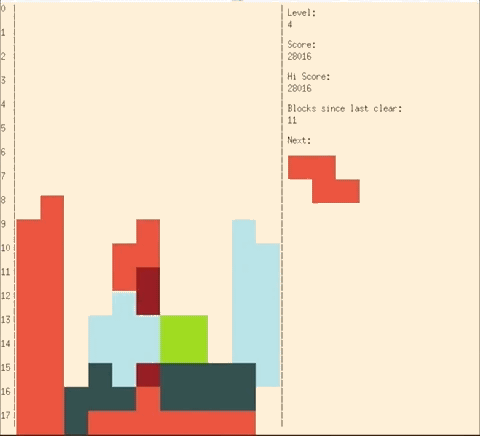

# Tetris school project

In this project, our group work together to produce the popular game Tetris. The project is programed in C++ with objected-oriented design that can be extended, scaled and resued, with high cohesion and low coupling. Also, the game includes a variety of levels and user interaction with keyboard input and a attactive GUI.

1.	Modularized Software Engineering. Separate the game by MVC pattern in different classes (Quadris - controller, Board – model, Textdisplay - view) and implement them separately. By doing so, our teamwork efficiency improved dramatically (since MVC offers support for rapid and parallel development) as well as safety (follow encapsulation rules), reusability, abstraction and maintainability of the project. It also facilitated unit test and integration test. Additionally, it also supports multiple ways of view (text or graphics). Also, modifications of controller or view never affect the core model because model does not depend on controller or view. Therefore, it enhances chances for reuse and customization.
2.	Observer pattern. Textdisplay and Graphicsdisplay are two subclasses of Observer (the super class). It supports the principle of low coupling between objects that interact with each other. It allows sending data to other objects effectively without any change in the Subject or Observer classes. Observer can be added/removed at any point in time, which demonstrates high resilience to change.
3.	Complete the hint function to show the “best move” of the current block. Adopt the advanced version of Pierre Dellacherie' algorithm and made some improvements. Use Genetic Algorithm to calculate the weight of all the factors (such as landing height and rows of elimination). Reference the following the blog post: (http://imake.ninja/el-tetris-an-improvement-on-pierre-dellacheries-algorithm/). You can find code details on 240-board.cc.
4.	Employ good object-oriented design techniques. Strictly follow the latest C++14 standards and use many features in STL that has been discussed in class (such as auto, iterator, and use smart pointers and vectors to manage memory), such that make the project more tidy, safe, efficient and dramatically reduce the opportunity of memory leak. Make the best use of OOP, such as inheritance, polymorphism (use virtual and pure virtual methods, thus provide abstraction over a variety of behaviors) and encapsulation (All the data fields are private, and clients can only access the data through accessors and mutators, so that the safety can be guaranteed.). No-throw exception guarantee is promised. 
5.	This project supports a cross-platform usage (i.e. it didn’t use any platform-related features). Increase compile efficiency by using a Makefile. 
6.	High efficiency program. For those methods that have efficiency concerns, we chose the best algorithm (both time efficiency and space efficiency) to implement our methods. 
7.	High quality and fully documented code. Do not have any duplicated code. Follow the basic coding styles and standards, improving the readability of the code. Every header file has the whole documentation provided. Every complicated implementation of a function in the C++ file has detailed explanations. Documentation and comments constitute a large proportion of the code. Every variable name and function name clearly indicates the purpose of itself. Thus, the code not only has clear logic and structure, but it also is pretty tidy and highly-readable.
8.	Completely Random sequence of blocks. In order to generate random-like numbers, we initialize srand to some distinctive runtime value, like the value returned by function time (declared in header <ctime>). This is distinctive enough for most trivial randomization needs. So that every time the user starts the game, it will always generate the different sequence.
9.	High cohesion and low coupling. We achieve low coupling by separating of different classes into different files, which will ensure minimum recompilation in the case of class modifications. For high cohesion, every .cc and .h file only defines methods that are related to the class, so that they all tend to achieve the same goal.

### BONUS

We add an additional command called “auto”, which allows the AI to start playing the game. Every time a block shows up, it will find the “best move” (the hint position) and put the block on that position automatically. During our testing, it can get 240000+ points without stopping under 10 minutes on our own machine. 

We have designed Attractive GUI. Use pleasing color combinations to allow users to have the best game experience. Use geometry knowledge (including golden rectangle) and Photoshop technology to make the best GUI through Xwindow. 
